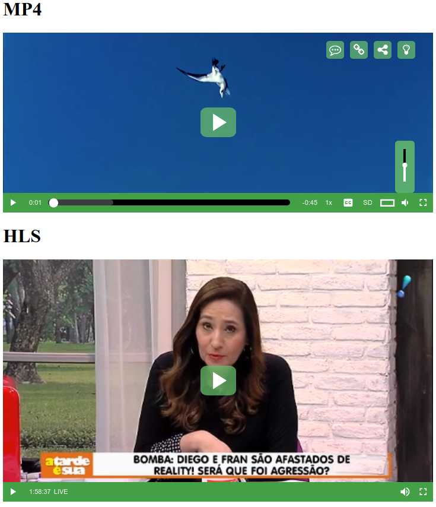
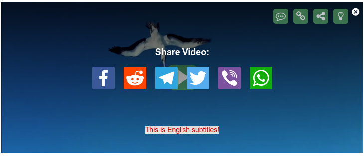

# videojs-green-skin

Green Skin for Video.js with pack of installed plugins

---

## Purpose

Green Skin is a Video.js example with collection of plugins and green skin design 

* [videojs-resolution-switcher](https://github.com/razzbee/videojs-resolution-switcher)
* [videojs-vast-vpaid](https://github.com/MailOnline/videojs-vast-vpaid)
* [videojs-contrib-hls](https://www.npmjs.com/package/@hola.org/videojs-contrib-hls)
* [videojs-theater-mode](https://github.com/jgubman/videojs-theater-mode) 
* [videojs-topbar-buttons](https://github.com/slavrinja/videojs-topbar-buttons)